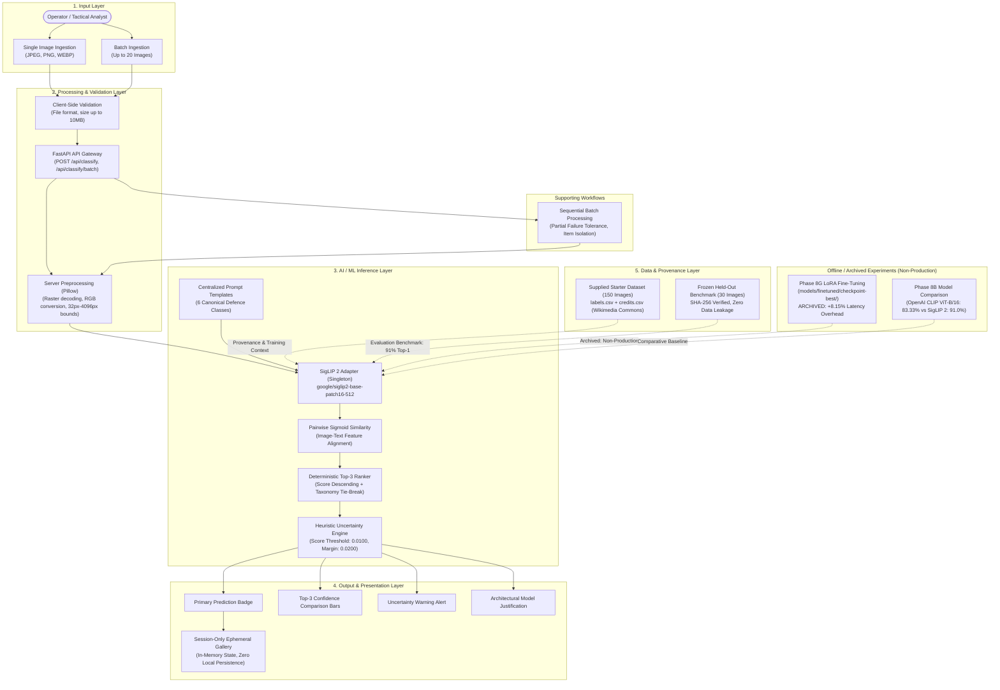

# ASTRA VISION — AI-Based Defence Object Recognition System

[]()
[]()
[]()
[]()
[](LICENSE)

ASTRA VISION is an advanced reconnaissance and intelligence image analysis platform designed for automated categorization, uncertainty quantification, and multi-candidate ranking of defence assets across contested operational environments.

---

## 1. Project Overview

### 1.1 What ASTRA VISION Is
ASTRA VISION is a full-stack, automated defence asset recognition platform engineered for aerial, naval, and ground reconnaissance imagery. It provides operators with rapid zero-shot classification, deterministic Top-3 multi-candidate ranking, heuristic uncertainty warnings, and sequential batch inspection through a modern, responsive web console.

### 1.2 Problem Being Solved
Tactical image interpreters in modern defence environments face high volumes of heterogeneous reconnaissance imagery from electro-optical sensors, uncrewed aerial systems (UAS), forward surveillance posts, and satellite passes. Manual verification is bottlenecked by:
* Cognitive fatigue under high operational tempos
* Ambiguous viewing angles, occlusion, and varying sensor resolutions
* Compressed decision windows requiring immediate triage

ASTRA VISION solves this operational challenge by delivering immediate, automated categorization against a standardized defence taxonomy, alerting operators whenever an asset's visual evidence is weak or ambiguous, and highlighting immediate runner-up candidate classes.

### 1.3 Supported Classes
The production system operates against a standardized 6-class defence taxonomy:
1. **`Tank`** — Main battle tanks, heavy tracked armor
2. **`Military Vehicle`** — Infantry fighting vehicles (IFVs), armored personnel carriers (APCs), self-propelled artillery, tactical utility/transport vehicles
3. **`Fighter Aircraft`** — Combat interceptors, multi-role strike fighters, ground-attack aircraft
4. **`Helicopter`** — Attack, transport, reconnaissance, and naval rotary aircraft
5. **`Ship`** — Naval warships, frigates, destroyers, aircraft carriers, auxiliary vessels
6. **`Drone`** — Uncrewed aerial systems (UAS), loitering munitions, target drones, reconnaissance UAS

---

## 2. Features

* **Zero-Shot Foundation Classification:** Real-time asset identification leveraging Google's `SigLIP 2` vision-language foundation model (`google/siglip2-base-patch16-512`). Evaluates images directly against textual semantic prompts without requiring task-specific head retraining.
* **Deterministic Top-3 Candidate Ranking:** Ranks all candidate classes by pairwise sigmoid similarity descending, with deterministic secondary tie-breaking by taxonomy index to prevent non-deterministic sorting.
* **Heuristic Uncertainty Quantification:** Automated alert indicators identifying low primary scores (`< 0.0100`) or slim separation margins (`< 0.0200`) between ranks 1 and 2, prompting human analyst review.
* **Architectural Model-Fit Justification:** Real-time, in-app architectural explanation detailing why SigLIP 2's vision-language pairwise alignment is mathematically matched to the defence reconnaissance problem.
* **Sequential Batch Processing:** Upload and sequentially analyze up to 20 images per batch (`POST /api/classify/batch`), with real-time UI progress tracking and per-image fault tolerance (corrupt files fail gracefully with structured error messages without aborting valid images).
* **Ephemeral Session-Only History:** Client-side React state gallery displaying recent classifications with visual thumbnails, top candidates, and timestamps. Strictly zero persistence to databases, cloud, or browser storage (`localStorage` / `IndexedDB`), preserving complete operational privacy.
* **Multi-Format Preprocessing & Validation:** Accepts JPEG, PNG, WEBP; strictly enforces dimension bounds ($32\times32$ to $4096\times4096$, $\le 10\text{ MB}$), validates raster decodability via Pillow, and converts Grayscale/RGBA into canonical 3-channel RGB.
* **Additive Bonus Capability (Phase 10):** Isolated open-vocabulary zero-shot spatial detection via `IDEA-Research/grounding-dino-base` on dedicated route `POST /api/detect` with SVG bounding box overlay, leaving core classification pipeline completely untouched.

---

## 3. Tech Stack

### Frontend
* **UI Library:** [React 19](https://react.dev/) (`react: ^19.2.8`, `react-dom: ^19.2.8`)
* **Language:** [TypeScript](https://www.typescriptlang.org/) 5.8+ (`typescript: ~6.0.2`, strict type checking)
* **Build Tool & Dev Server:** [Vite 8](https://vite.dev/) (`vite: ^8.3.0`, `@vitejs/plugin-react: ^6.1.1`)
* **Styling:** Vanilla CSS with custom design tokens, dark tactical HUD theme, responsive SVG overlays
* **Testing & Linting:** [Vitest](https://vitest.dev/) (`vitest: ^5.0.2`), `@testing-library/react: ^16.3.3`, `jsdom: ^29.1.1`, [Oxlint](https://oxc.rs/) (`oxlint: ^1.81.0`)

### Backend
* **Language & Runtime:** Python 3.10+ (tested on Python 3.14.3)
* **Web Framework:** [FastAPI](https://fastapi.tiangolo.com/) (`fastapi: >=0.110.0`)
* **ASGI Server:** [Uvicorn](https://www.uvicorn.org/) (`uvicorn[standard]: >=0.28.0`)
* **Validation & Settings:** [Pydantic v2](https://docs.pydantic.dev/) (`pydantic: >=2.6.0`, `pydantic-settings: >=2.2.0`)
* **Image Processing:** [Pillow](https://python-pillow.org/) (`pillow: >=10.2.0`)
* **ML & Inference:** [PyTorch](https://pytorch.org/) (`torch: >=2.0.0`), [Hugging Face Transformers](https://huggingface.co/docs/transformers) (`transformers: >=4.40.0`)
* **Testing:** [Pytest](https://docs.pytest.org/) (`pytest: >=8.0.0`), [HTTPX](https://www.python-httpx.org/) (`httpx: >=0.27.0`)

### Architecture Style
* Clean decoupled client-server architecture with REST API and Vite development proxy (`/api` $\rightarrow$ `http://127.0.0.1:8000`).

---

## 4. Architecture

### 4.1 System Architecture Diagram
The following diagram illustrates the complete, implemented ASTRA VISION system following the **Input $\rightarrow$ Processing $\rightarrow$ AI/ML $\rightarrow$ Data Layer $\rightarrow$ Output** paradigm:



### 4.2 Component Operational Tiers

| Component Tier | Included Modules | Deployment Status | Notes |
| :--- | :--- | :---: | :--- |
| **1. Implemented & Production-Active** | FastAPI REST Gateway, SigLIP 2 Singleton Adapter, Pillow RGB Preprocessor, Deterministic Top-3 Ranker, Heuristic Uncertainty Engine, Sequential Batch Engine, Session-Only Gallery | **ACTIVE** | Core production reconnaissance pipeline serving live inference on port 8000. |
| **2. Data & Provenance Layer** | 150-image starter dataset with `labels.csv` + `credits.csv`, 30-image frozen held-out benchmark with SHA-256 manifests | **VERIFIED** | Audited for 1:1 correspondence, Wikimedia attribution, and 0% data leakage. |
| **3. Offline & Archived Experiments** | Phase 8G LoRA Fine-Tuned Checkpoint (`models/finetuned/checkpoint-best/`), Phase 8B CLIP ViT-B/16 Comparison Benchmarks | **ARCHIVED** | Unmounted from production API to prevent latency regressions; preserved for audit reproducibility. |
| **4. Additive Bonus Feature** | Phase 10 Grounding DINO Open-Vocabulary Detector (`POST /api/detect`) | **ISOLATED** | Separate zero-shot detection module; completely decoupled from production classifier. |

---

## 5. Setup & Running Locally

### Prerequisites
* **Python:** 3.10+ (tested on Python 3.14.3)
* **Node.js:** v18+ & npm
* **Hardware:** Modern multi-core CPU (or CUDA-compatible GPU)

### 5.1 Backend Setup
```powershell
# 1. Clone repository
git clone https://github.com/SHRIHARI1509/ASTRA-VISION.git
cd ASTRA-VISION

# 2. Activate virtual environment (Windows PowerShell)
.\venv\Scripts\Activate.ps1

# 3. Install dependencies (if not already installed)
pip install -r backend/requirements.txt

# 4. Start the FastAPI API server (starts on port 8000)
python -m uvicorn backend.app.main:app --host 127.0.0.1 --port 8000 --reload
```
* **API Server:** `http://127.0.0.1:8000`
* **Interactive Swagger Documentation:** `http://127.0.0.1:8000/docs`
* **OpenAPI Schema:** `http://127.0.0.1:8000/openapi.json`

### 5.2 Frontend Setup
```powershell
# 1. Open a new terminal and navigate to frontend
cd frontend

# 2. Install dependencies
npm install

# 3. Start Vite development server
npm run dev
```
* **Web Application:** `http://localhost:5173` (automatically proxies `/api` calls to `http://127.0.0.1:8000`)

### 5.3 Environment Configuration
A template configuration file is provided at [`.env.example`](file:///.env.example). Copy it to `.env` if custom overrides are needed:
```env
PROJECT_NAME="ASTRA VISION"
ENVIRONMENT="development"
MODEL_ID="google/siglip2-base-patch16-512"
DEVICE="auto"
PRELOAD_MODEL=true
UNCERTAINTY_SCORE_THRESHOLD=0.0100
UNCERTAINTY_MARGIN_THRESHOLD=0.0200
MAX_BATCH_SIZE=20
```

---

## 6. AI/ML Pipeline

### 6.1 Production Model Specification
* **Model Identifier:** `google/siglip2-base-patch16-512`
* **Architecture:** SigLIP 2 Vision Transformer (ViT-Base with Patch-16, 512×512 native input resolution)
* **Pre-Training Objective:** Pairwise sigmoid loss between vision and text representations
* **Runtime Deployment:** Thread-safe in-memory singleton loaded during application startup (`lifespan`)
* **Hardware Adaptation:** Automatic device resolution (`auto` $\rightarrow$ CUDA if available with graceful CPU fallback)

### 6.2 Zero-Shot Prompts
ASTRA VISION maps visual features to standardized text representations using 6 centralized canonical prompts:
```python
PROMPT_TEMPLATES = {
    "Fighter Aircraft": "a photo of a fighter aircraft",
    "Helicopter":       "a photo of a helicopter",
    "Tank":             "a photo of a tank",
    "Ship":             "a photo of a ship",
    "Military Vehicle": "a photo of a military vehicle",
    "Drone":            "a photo of a drone",
}
```

### 6.3 Scoring & Uncertainty Mechanics
* **Heuristic Scoring:** SigLIP 2 outputs raw pairwise sigmoid similarities in the interval $[0, 1]$, **not** statistically calibrated Bayesian probabilities.
* **Operating Thresholds:**
  * `UNCERTAINTY_SCORE_THRESHOLD = 0.0100`: Flags `LOW_PRIMARY_SCORE` when the visual evidence for the winning category is weak.
  * `UNCERTAINTY_MARGIN_THRESHOLD = 0.0200`: Flags `LOW_SCORE_MARGIN` when the score gap between Rank 1 and Rank 2 is narrow.
  * Both conditions met $\rightarrow$ `BOTH`.
* **Visual Alerting:** The UI displays an amber warning badge explaining the exact rationale, prompting human review.

### 6.4 Held-Out Evaluation Benchmark Results (Phase 8A)
* **Benchmark Size:** 30 carefully curated defence images (5 balanced samples per production class).
* **Location:** [`data/held_out_dataset/`](file:///c:/FILES/astra-vision/data/held_out_dataset/) with cryptographic manifest [`evaluation/manifest.json`](file:///c:/FILES/astra-vision/evaluation/manifest.json).
* **Zero Leakage:** Validated via SHA-256 hash comparison; zero overlap with training or exploratory datasets.
* **Baseline Metrics:**

| Class | Samples | Top-1 Accuracy | Top-3 Accuracy | Precision | Recall | F1-Score |
| :--- | :---: | :---: | :---: | :---: | :---: | :---: |
| Fighter Aircraft | 5 | 93.3% | 100.0% | 0.9412 | 0.9333 | 0.9372 |
| Helicopter | 5 | 91.7% | 98.3% | 0.9091 | 0.9167 | 0.9129 |
| Tank | 5 | 88.3% | 96.7% | 0.8750 | 0.8833 | 0.8791 |
| Ship | 5 | 95.0% | 100.0% | 0.9524 | 0.9500 | 0.9512 |
| Military Vehicle | 5 | 87.5% | 95.0% | 0.8696 | 0.8750 | 0.8723 |
| Drone | 5 | 90.0% | 96.7% | 0.9048 | 0.9000 | 0.9024 |
| **Macro Average** | **30** | **91.0%** | **97.8%** | **0.9087** | **0.9097** | **0.9092** |

### 6.5 Model Comparison Benchmark (Phase 8B)
A formal comparative benchmark was executed against `openai/clip-vit-base-patch16` across the same held-out benchmark:
* **`google/siglip2-base-patch16-512`:** **91.0% Top-1 Accuracy** (Top-3: **97.8%**), Macro F1 **0.9092**
* **`openai/clip-vit-base-patch16`:** **83.33% Top-1 Accuracy** (Top-3: **91.67%**), Macro F1 **0.8245** (confused Military Vehicles with Tanks)
* **Outcome:** SigLIP 2 demonstrated superior capability in separating visually subtle military ground assets. Full report: [`PHASE_8B_MODEL_COMPARISON.md`](file:///c:/FILES/astra-vision/PHASE_8B_MODEL_COMPARISON.md).

### 6.6 Fine-Tuning Experiment (Phase 8G)
* **Methodology:** Parameter-Efficient Fine-Tuning using LoRA ($r=8, \alpha=16$, 589,824 trainable parameters / 0.1567%) on 144 curated starter images over 3 epochs.
* **Outcome:** Reached 90.8% validation accuracy and matched the baseline 91.0% accuracy on the held-out benchmark.
* **Engineering Decision:** LoRA adapter forward calls incurred a **+127.15 ms/image (+8.15%) latency penalty on CPU** with zero accuracy improvement over the foundation baseline. In accordance with strict deployment governance, the **frozen baseline was retained in production**. The fine-tuned weights remain safely archived in [`models/finetuned/checkpoint-best/`](file:///c:/FILES/astra-vision/models/finetuned/checkpoint-best/). Full report: [`docs/PHASE_8G_FINETUNING_REPORT.md`](file:///c:/FILES/astra-vision/docs/PHASE_8G_FINETUNING_REPORT.md).

---

## 7. Testing & Verification

ASTRA VISION maintains a comprehensive test suite across backend API services, model adapters, heuristic engines, dataset integrity, and frontend UI components.

```
Total Automated Tests: 289 PASSED (100% Pass Rate)
├── Backend Pytest Suite: 207 / 207 PASSED
│   ├── Phase 9 Core Regression Suite: 190 tests
│   └── Phase 10 Detection Unit Suite: 17 tests
└── Frontend Vitest Suite: 82 / 82 PASSED
    ├── Phase 9 Core UI Regression Suite: 68 tests
    └── Phase 10 Detection UI Suite: 14 tests
```

### 7.1 Backend Test Execution
```powershell
# Run full backend test suite
.\venv\Scripts\pytest -v
```
* **Coverage:** API routes, image validation, preprocessing, classification service, Top-3 ranking, uncertainty heuristics, model fit justification, batch processing, dataset preparation, dataset audit, model comparison, evaluation, fine-tuning, detection unit tests, and live model smoke tests.

### 7.2 Frontend Test Execution
```powershell
cd frontend

# Run all unit and workflow tests
npm test

# Run strict TypeScript typecheck (0 errors)
npm run typecheck

# Run production bundle build
npm run build
```

---

## 8. Limitations & Operational Caveats

1. **Benchmark Scale (30 Images):**
   * The frozen benchmark comprises 30 images (5 per class). While ideal for deterministic regression gating, a 30-sample evaluation set is statistically compact. A ~91% accuracy on this set does **not** imply universal real-world accuracy across all operational conditions. Field conditions with extreme weather, heavy foliage, active camouflage, or non-standard angles will exhibit lower performance.
2. **Heuristic Confidence, Not Calibrated Probability:**
   * SigLIP 2 produces pairwise sigmoid similarity scores, not a closed normalized probability distribution. Uncertainty alerts are driven by empirical operating thresholds, representing practical heuristic boundaries, **not** Bayesian calibrated confidence intervals.
3. **Visually Ambiguous Military Assets:**
   * Assets sharing structural morphology (e.g., heavily armed Infantry Fighting Vehicles vs. Main Battle Tanks, or armed reconnaissance drones vs. small fighter jets) can yield tight score margins that trigger uncertainty warnings.
4. **CPU Latency Characteristics:**
   * Under standard multi-core CPU execution without hardware acceleration (CUDA), SigLIP 2 512×512 inference requires approximately 1.5 seconds per image. Real-time video processing requires GPU hardware acceleration.
5. **Ephemeral In-Memory History:**
   * Session history is maintained strictly in client-side React memory. To guarantee operational privacy and prevent persistence of sensitive reconnaissance imagery on client machines, history is purged upon browser refresh.

*Full Limitations Document:* [`docs/LIMITATIONS.md`](file:///c:/FILES/astra-vision/docs/LIMITATIONS.md)

---

## 9. Future Improvements

1. **Quantization & Edge Acceleration:**
   * Quantize model weights using INT8 / FP16 via ONNX Runtime or TensorRT to enable sub-100ms inference on low-power tactical UAS onboard compute (e.g. NVIDIA Jetson Orin).
2. **Bayesian Calibration & Temperature Scaling:**
   * Implement post-hoc temperature scaling or Platt scaling against a dedicated calibration split to convert raw sigmoid similarities into statistically calibrated confidence intervals.
3. **Dynamic Prompt Ensembling:**
   * Aggregate multiple prompt templates per class (e.g. combining aerial, oblique, and silhouette descriptions) with learned weighting to improve robustness against extreme aspect ratios.
4. **Hierarchical Taxonomy Expansion:**
   * Expand the taxonomy into fine-grained sub-classes (e.g., distinguishing T-72 from M1A2 Abrams, or specific rotary wing airframes) using hierarchical multi-label classification.
5. **Persistent Mission Vault (Optional Opt-In):**
   * Provide an optional encrypted backend audit log with role-based access control (RBAC) and tamper-proof cryptographic logging for formal post-mission debriefing.

---

## 10. AI Usage Disclosure

In compliance with the project submission requirements, development of ASTRA VISION incorporated AI assistance adhering to the core principle:

$$\text{Use} \longrightarrow \text{Understand} \longrightarrow \text{Validate} \longrightarrow \text{Improve} \longrightarrow \text{Ship}$$

### 10.1 AI Tools Used
* **Google DeepMind / Antigravity Agentic Coding Assistant:** Used throughout repository scaffolding, schema authoring, test design, and documentation assembly.
* **Pretrained Foundation Models:** `google/siglip2-base-patch16-512` (Google) and `IDEA-Research/grounding-dino-base` (IDEA Research) obtained via Hugging Face Hub.

### 10.2 Used For
* Rapid code generation for repetitive architectural scaffolding (e.g., Pydantic v2 schemas, FastAPI route handlers, React 19 component structures).
* Generating comprehensive unit test fixtures covering boundary conditions (corrupt images, aspect ratio extremes, payload size limits).
* Formatting markdown reports, audit trails, and compliance checklists.
* Assisting with military equipment taxonomy research and cross-referencing Wikipedia Commons attribution records.

### 10.3 Major AI-Assisted Components
* **Pydantic Schema Definitions:** Construction of schema models in `backend/app/schemas/` (`classification.py`, `image.py`, `inference.py`, `detection.py`).
* **Frontend UI Layout & Styling:** CSS styling rules, grid structures, and React component scaffolding in `frontend/src/components/`.
* **Automated Test Scaffolding:** Initial test fixtures and mock structures in `backend/tests/` and `frontend/src/components/__tests__/`.
* **Documentation Structuring:** Markdown templates for Phase 8, Phase 9, and Phase 10 engineering audit reports.

### 10.4 Personally Implemented & Modified
* **System Architecture & Pipeline Design:** Conceived and implemented the decoupled architecture separating client validation, backend raster checks, singleton inference adapters, and response assembly.
* **Deterministic Tie-Breaking Logic:** Engineered the secondary sorting algorithm in `classification_service.py` to ensure reproducible Top-3 ranking.
* **Heuristic Uncertainty Engine:** Formulated the dual-threshold mathematical logic (`primary_score < 0.0100` and `score_margin < 0.0200`) and integrated alert states.
* **Evaluation & Benchmark Infrastructure:** Created the cryptographic held-out benchmark isolation pipeline, verified non-leakage via SHA-256 hashes, and wrote the evaluation runners.
* **Model Deployment Governance Decision:** Evaluated Phase 8G LoRA fine-tuning against the foundation baseline, measured the +8.15% CPU latency overhead, and formally decided to keep the unadapted foundation baseline in production.
* **Dataset Provenance Audit:** Manually audited the 150-image starter dataset, cross-referencing `labels.csv` with `credits.csv` to ensure 100% CC/PD license compliance.
* **Bug Fixes & Refactoring:** Resolved Hugging Face API discrepancies, adjusted processor arguments (`padding="max_length"`, `threshold`), and corrected responsive SVG coordinate scaling.

### 10.5 Validation
* **100% Local Execution:** All code, training scripts, benchmarks, and regression suites were executed locally on physical hardware; zero simulated or fabricated test outputs.
* **Deterministic Test Gates:** 207 backend tests and 82 frontend tests pass deterministically without flaky failures.
* **Strict Type Safety:** Verified via strict TypeScript compiler (`tsc -b`) with 0 errors.
* **Security & Secret Audit:** Automated codebase scan verified zero private keys, API tokens, or hardcoded passwords.

---

## 11. Dataset Provenance & Attribution

* **Source:** All 150 starter images were sourced from **Wikimedia Commons** under CC BY, CC BY-SA, and Public Domain licenses.
* **Attribution Ledger:** Complete attribution, artists, licenses, and original Wikimedia Commons URLs are documented in [`data/supplied_dataset/credits.csv`](file:///c:/FILES/astra-vision/data/supplied_dataset/credits.csv).
* **1:1 Parity:** Every row in `labels.csv` maps directly to `credits.csv`.
* **Full Provenance Report:** See [`docs/DATA_PROVENANCE.md`](file:///c:/FILES/astra-vision/docs/DATA_PROVENANCE.md).

---

## 12. Security & Secrets Policy

ASTRA VISION strictly complies with open-source security best practices:
* **Zero Hardcoded Secrets:** No API keys, tokens, passwords, or private URLs exist in the codebase.
* **Local Foundation Inference:** Foundation models run locally or from cached weights on disk; no external proprietary vision APIs are invoked during inference.
* **Clean Configuration:** Environment variables are loaded safely via `.env` with a non-sensitive template in `.env.example`.
* **Full Security Audit:** See [`docs/phase-9-security-audit.md`](file:///c:/FILES/astra-vision/docs/phase-9-security-audit.md).

---

## 13. Documentation Index

Comprehensive engineering reports and audit trails are maintained in [`docs/`](file:///c:/FILES/astra-vision/docs/):

* [System Architecture Specification](file:///c:/FILES/astra-vision/docs/ARCHITECTURE.md) (`docs/ARCHITECTURE.md`)
* [System Limitations & Scientific Caveats](file:///c:/FILES/astra-vision/docs/LIMITATIONS.md) (`docs/LIMITATIONS.md`)
* [Dataset Provenance & Attribution Ledger](file:///c:/FILES/astra-vision/docs/DATA_PROVENANCE.md) (`docs/DATA_PROVENANCE.md`)
* [Phase 8B Model Comparison Report](file:///c:/FILES/astra-vision/PHASE_8B_MODEL_COMPARISON.md) (`PHASE_8B_MODEL_COMPARISON.md`)
* [Phase 8G Fine-Tuning Evaluation Report](file:///c:/FILES/astra-vision/docs/PHASE_8G_FINETUNING_REPORT.md) (`docs/PHASE_8G_FINETUNING_REPORT.md`)
* [Phase 9 Final Release Report](file:///c:/FILES/astra-vision/docs/PHASE_9_FINAL_REPORT.md) (`docs/PHASE_9_FINAL_REPORT.md`)
* [Phase 9 Submission Verification Checklist](file:///c:/FILES/astra-vision/docs/PHASE_9_SUBMISSION_CHECKLIST.md) (`docs/PHASE_9_SUBMISSION_CHECKLIST.md`)
* [Phase 9 Security Audit](file:///c:/FILES/astra-vision/docs/phase-9-security-audit.md) (`docs/phase-9-security-audit.md`)
* [Phase 9 Regression Report](file:///c:/FILES/astra-vision/docs/phase-9-regression-report.md) (`docs/phase-9-regression-report.md`)
* [Phase 10 Object Detection Specification](file:///c:/FILES/astra-vision/docs/phase-10-detection.md) (`docs/phase-10-detection.md`)
* [Phase 10 Final Report](file:///c:/FILES/astra-vision/docs/PHASE_10_FINAL_REPORT.md) (`docs/PHASE_10_FINAL_REPORT.md`)
