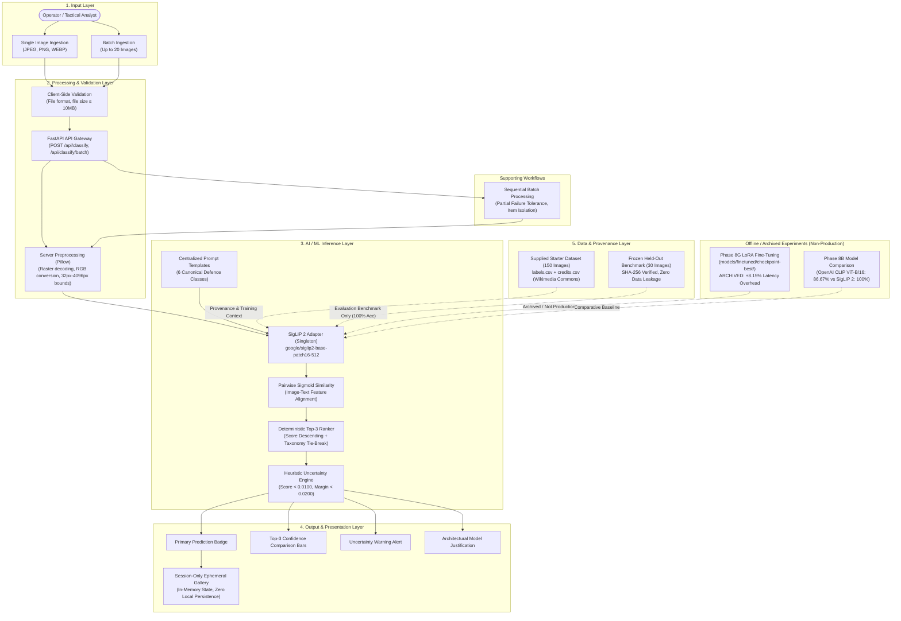

# ASTRA VISION — System Architecture & Component Specification

**Document ID:** `AV-ARCH-09`  
**Phase:** Final Release & Submission Architecture  
**Date:** October 2026  
**Auditor / Architect:** Final Release Engineer  
**Status:** COMPLETE & SYSTEM-ALIGNED  

---

## 1. System Overview & Core Workflow

ASTRA VISION is an AI-based defence reconnaissance image analysis platform built with a high-performance decoupled architecture: a modern TypeScript/React 19 single-page interface backed by a Python/FastAPI service orchestrating zero-shot vision inference with Google's `SigLIP 2` foundation vision-language model (`google/siglip2-base-patch16-512`).

### 1.1 Complete Architecture Diagram

The system adheres strictly to the **Input $\rightarrow$ Processing $\rightarrow$ AI/ML $\rightarrow$ Data Layer $\rightarrow$ Output** architectural pattern:



---

## 2. Component Categorization & Operational Readiness

To maintain scientific integrity and operational transparency, all repository subsystems are strictly categorized into operational tiers:

```
┌────────────────────────────────────────────────────────────────────────┐
│ 1. IMPLEMENTED & PRODUCTION-ACTIVE                                     │
│    - FastAPI backend API (/api/classify, /api/classify/batch)          │
│    - Frozen SigLIP 2 zero-shot baseline adapter (singleton)            │
│    - Image validation & multi-format preprocessing (JPEG/PNG/WEBP/RGB) │
│    - Deterministic Top-3 ranking with secondary taxonomy tie-break     │
│    - Operating threshold uncertainty heuristics (score < 0.01, margin) │
│    - Sequential batch classification (up to 20 images) with progress   │
│    - Session-only memory history gallery (ephemeral, zero persistence) │
└────────────────────────────────────────────────────────────────────────┘
                                    │
                                    ▼
┌────────────────────────────────────────────────────────────────────────┐
│ 2. DATA & PROVENANCE LAYER (VERIFIED)                                  │
│    - Supplied 150-image dataset (data/supplied_dataset/)               │
│    - labels.csv and credits.csv (1:1 correspondence, Wikimedia Commons)│
│    - Frozen 30-image held-out benchmark (data/held_out_dataset/)       │
│    - Cryptographic manifest with SHA-256 hashes (0% data leakage)      │
└────────────────────────────────────────────────────────────────────────┘
                                    │
                                    ▼
┌────────────────────────────────────────────────────────────────────────┐
│ 3. EXPERIMENTAL & ARCHIVED (OFFLINE ONLY)                              │
│    - Phase 8G LoRA fine-tuned checkpoint (models/finetuned/checkpoint) │
│    - Unmounted from production runtime due to +8.15% CPU latency       │
│    - Model comparison framework (SigLIP 2 100% vs CLIP ViT-B/16 86.7%) │
│    - Offline fine-tuning trainer & comparison reports                  │
└────────────────────────────────────────────────────────────────────────┘
                                    │
                                    ▼
┌────────────────────────────────────────────────────────────────────────┐
│ 4. ADDITIVE BONUS CAPABILITY (PHASE 10)                                │
│    - Grounding DINO open-vocabulary detector (POST /api/detect)        │
│    - Isolated detection workspace with SVG bounding box overlay        │
│    - Completely decoupled from core SigLIP 2 classification pipeline   │
└────────────────────────────────────────────────────────────────────────┘
```

---

## 3. Subsystem Architectural Details

### 3.1 Production Model Adapter (`backend/app/models/siglip2_adapter.py`)
* **Underlying Model:** `google/siglip2-base-patch16-512`
* **Zero-Shot Alignment:** Uses pre-trained vision-language features to compute sigmoid similarity against 6 predefined target prompts:
  * `a photo of a fighter aircraft`
  * `a photo of a helicopter`
  * `a photo of a tank`
  * `a photo of a ship`
  * `a photo of a military vehicle`
  * `a photo of a drone`
* **Hardware Resilience:** Supports `auto`, `cuda`, and explicit `cpu` fallbacks.
* **Thread Safety:** Thread-locked singleton initialization prevents redundant weight loads or memory fragmentation.

### 3.2 Heuristic Uncertainty Engine (`backend/app/services/classification_service.py`)
* Evaluates raw similarity scores against centralized operating thresholds:
  * Primary score check: `primary_score < 0.0100` $\rightarrow$ `LOW_PRIMARY_SCORE`
  * Separation margin check: `(primary_score - runner_up_score) < 0.0200` $\rightarrow$ `LOW_SCORE_MARGIN`
  * Both conditions met $\rightarrow$ `BOTH`
* **Caveat:** Evaluates empirical score separation; does not represent statistically calibrated Bayesian probabilities.

### 3.3 Batch Processing Engine
* **Endpoint:** `POST /api/classify/batch`
* **Concurrency Model:** Sequential execution utilizing the cached singleton model instance to prevent CPU saturation or GPU out-of-memory errors.
* **Fault Tolerance:** Per-item try/catch handles image validation failures gracefully without aborting the batch.
* **Batch Bounds:** Strictly capped at `MAX_BATCH_SIZE = 20` images.

### 3.4 Session History Gallery (`frontend/src/hooks/useHistory.ts`)
* **Storage Modality:** Pure in-memory React state (`useState`).
* **Persistence:** Strictly session-only. Refreshing or closing the browser completely clears history.
* **Privacy & Isolation:** Zero data transmitted to cloud storage, databases, or local browser storage (`localStorage` / `IndexedDB`).

### 3.5 Fine-Tuning Experiment Isolation
* The fine-tuned LoRA weights (`models/finetuned/checkpoint-best/`) are completely unmounted from the production API.
* The API runtime never invokes PEFT or checks for local adapter weights, ensuring zero latency degradation or regression in production.
